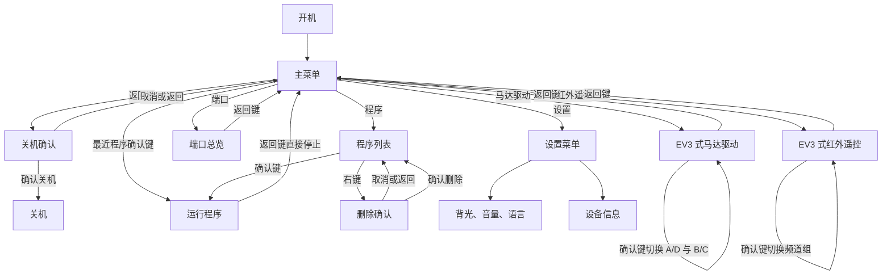

# EST OS 用户菜单与交互设计 V1

日期：2026-08-30

状态：首版界面、按键和异常状态规则已冻结；等待在已验收固件基线上实现

## 1. 设计目标

EST OS 面向普通学生和教师，目标是用尽可能少的菜单完成以下操作：

1. 选择、运行和删除程序。
2. 在同一个页面查看 A-D 输出端口和 1-4 输入端口。
3. 手动驱动马达，并使用红外遥控器控制左右马达。
4. 调整少量常用设置并查看设备信息。
5. 所有用户界面同时提供中文和英文显示。

普通界面不提供原始 ADC、Flash 测试、引脚测试等工程功能。工程功能应放入独立维护模式，避免干扰日常使用。

## 2. 硬件假设

- 屏幕：180 x 128 单色 LCD。
- 按键：返回、左、上、下、右、确认，共六个实体按键。
- 物理布局：返回和确认在上排，四个方向键在下方。
- 输入端口：1、2、3、4。
- 输出端口：A、B、C、D。

按键编号和功能固定如下：

| 按键编号 | 功能 |
| --- | --- |
| `KEY0` | 返回 |
| `KEY1` | 左 |
| `KEY2` | 上 |
| `KEY3` | 下 |
| `KEY4` | 右 |
| `KEY5` | 确认 |

## 3. 设计原则

- 主菜单固定显示最近程序快捷入口、程序、端口和设置四个选项。
- 主菜单第一项显示最近下载或最近运行的 `.py` 程序，作为一键运行快捷入口。
- 首版必须同时提供中文和 English，不得把中文延后；首次启动默认中文。
- 只有开发构建确实未包含中文字库时才允许临时回退 English，该构建不视为首版验收通过。
- 普通操作最多进入两层子页面。
- 确认键优先执行当前对象的主要操作。
- 返回键在子页面返回上一级；在程序运行页面直接终止程序；在主菜单打开关机确认。
- 删除程序必须经过确认弹窗，默认选择“取消”。
- 关机必须经过确认弹窗；返回键取消，确认键关机，左右键无操作。
- 长按返回键始终作为紧急停止操作，停止程序和全部马达并返回主菜单。
- 端口页面上方显示马达端口和数据，下方显示传感器端口和数据；所有主动输出集中在“马达驱动”和“红外遥控”页面。
- 传感器或马达断开后显示“未连接”，不得继续显示旧数据。
- 离开控制页面、遥控信号超时或设备断开时，必须立即停止相关马达。

## 4. 页面结构



## 5. 全局按键规则

| 按键 | 普通页面 | 数值或弹窗页面 | 程序运行页面 | 马达驱动页面 | 红外遥控页面 |
| --- | --- | --- | --- | --- | --- |
| 上 | 选择上一项 | 无操作或增加数值 | 无操作 | A 或 B 正转 | 无操作 |
| 下 | 选择下一项 | 无操作或减少数值 | 无操作 | A 或 B 反转 | 无操作 |
| 左 | 切换选项 | 选择左侧按钮或减小数值 | 无操作 | D 或 C 反转 | 无操作 |
| 右 | 程序列表中打开删除弹窗 | 选择右侧按钮或增加数值 | 无操作 | D 或 C 正转 | 无操作 |
| 确认 | 进入页面或执行主要操作 | 确认当前选择 | 交给用户程序 | 切换 A/D 与 B/C 端口组 | 切换频道 1/2 与 3/4 组 |
| 返回 | 返回上一级；主菜单打开关机确认 | 取消并返回 | 直接停止程序并返回主菜单 | 停止全部马达并返回 | 停止全部马达并返回 |
| 长按返回 | 停止全部马达并回到主菜单 | 同左 | 立即停止程序并回到主菜单 | 停止全部马达并回到主菜单 | 停止全部马达并回到主菜单 |

## 6. 页面示意图

### 6.1 开机画面

```text
+----------------------------+
|                            |
|                            |
|           EST              |
|                            |
|         正在启动           |
|                            |
|                            |
+----------------------------+
```

启动完成后自动进入主菜单，不要求用户确认。

### 6.2 主菜单

```text
+----------------------------+
| EST                 BAT 90%|
|----------------------------|
| [文件] [程序] [端口] [设置]|
| 巡线.py  程序   端口   设置|
|                            |
|                            |
|                            |
| USB:已连接         M0.64A  |
+----------------------------+
```

- 四个主要入口使用 `32 x 32` 单色大图标横向排列，文字由系统字库绘制在图标下方，不写入图片。
- 当前选中项将图标和文字所在的固定短区域整体反白；四个反白区域的垂直中线保持一致，不铺满主内容区。
- 文字紧贴图标下方；左右键切换选项，上下键执行相同的前后切换以兼容原操作习惯。
- 第一项是最近程序快捷入口，默认选中；确认后立即运行，不进入程序列表。
- 成功下载程序或开始运行程序时更新快捷入口，两类事件按发生时间取最新一次。
- 快捷程序被删除后显示下一个仍存在的最近程序；没有可用程序时显示“暂无最近程序”，确认键无操作。
- 其他项目按确认键进入选中的页面；主菜单内容超过一屏时上下滚动。
- USB 未连接时显示 `USB:未连接`。
- 底部版本号显示当前 APP 版本。
- 图标源文件和固件位图位于 `docs/assets/menu_icons/`。
- 在主菜单按返回键打开关机确认弹窗，不直接关机。

### 6.2.1 关机确认

```text
+----------------------------+
|          确认关机？        |
|                            |
|        是否关闭 EST？      |
|                            |
|    返回 取消    确认 关机  |
+----------------------------+
```

- 弹窗不设置选中项，左右键无操作。
- 返回键取消并回到主菜单。
- 确认键直接执行设备关机。

### 6.3 程序列表

```text
+----------------------------+
| 程序                       |
|----------------------------|
| > 小车巡线                 |
|   自动避障                 |
|   我的程序 1               |
|   我的程序 2               |
|                            |
+----------------------------+
```

- 上下键选择程序。
- 确认键立即运行选中的程序。
- 右键打开所选程序的删除确认弹窗。
- 返回键回到主菜单。
- 程序超过一屏时上下滚动，当前选中项始终保持可见。

程序为空时显示：

```text
+----------------------------+
| 程序                       |
|----------------------------|
|                            |
|          没有程序          |
|                            |
|                            |
+----------------------------+
```

### 6.4 删除确认

```text
+----------------------------+
| 删除程序？                 |
|----------------------------|
| “我的程序 1”               |
|                            |
| 操作无法恢复               |
|                            |
|    > 取消        删除      |
+----------------------------+
```

- 默认选择“取消”。
- 左右键切换“取消”和“删除”。
- 确认键执行当前选择。
- 返回键等同于取消。
- 删除完成后返回程序列表，并选中相邻程序。
- 正在运行的程序不能删除。
- 标记为系统程序的文件不能删除；右键时短暂显示“系统程序不可删除”。

### 6.5 程序运行

```text
+----------------------------+
| 小车巡线                   |
|----------------------------|
|                            |
|          运行中            |
|                            |
|          00:01:28          |
|                            |
| 1:灰度 42        A/B:30%   |
+----------------------------+
```

- 运行页面不提供暂停或继续功能，不显示 `HOLD OK PAUSE`。
- 确认键不被系统菜单占用，按键事件交给正在运行的用户程序。
- 返回键直接停止程序并返回主菜单，不显示确认弹窗。
- 长按返回键同样立即停止并返回主菜单。
- 程序异常结束时停止全部马达，并显示简短错误信息。

### 6.6 直接停止

- 运行页面按返回键时，立即停止当前用户程序和全部马达，再返回主菜单。
- 不显示停止确认弹窗；删除程序仍必须显示确认弹窗。

### 6.7 端口查看

```text
+----------------------------+
| 端口查看                   |
|----------------------------|
| > 马达 A-D                 |
| [A]  B   C   D             |
| 设备 大型马达 状态 停止    |
|   传感器 1-4               |
| [1]  2   3   4             |
| 设备 红外   数值 P100      |
+----------------------------+
```

- 马达端口 `A..D` 放在页面上方，传感器端口 `1..4` 放在页面下方。
- 两个分区均保留原来的横向端口选择栏，当前端口反白显示，并在选择栏下方显示该端口的设备、状态和主数据。
- 上下键在马达分区和传感器分区之间切换，左右键在当前分区的四个端口之间循环切换；两个分区分别记住自己的当前端口。
- 端口数据在本页更新，不进入下一级详情页；确认键不执行操作。
- 返回键回到主菜单。
- 输入端口根据传感器类型显示对应模式和单位，例如距离使用 `cm`，温度使用 `C`，陀螺仪显示角度或角速度。
- 状态可显示停止、运行或制动。
- 马达类型可显示大型、中型、未连接或识别中。
- 端口查看页面只读，不在此页面启动马达。
- 类型尚未稳定时不得沿用上一次马达类型。
- 端口断开后立即显示“未连接”，模式、当前值、速度、角度和圈数等无效字段显示 `--`。

### 6.8 马达驱动

马达驱动参考 EV3 Brick 的 Motor Control 应用，使用实体方向键即时控制两个马达，不设置角度、圈数或运行任务。

```text
+----------------------------+
| 马达驱动          A / D    |
|----------------------------|
| A 大型：停止        0%     |
| D 中型：停止        0%     |
|                            |
| 上/下：A     左/右：D      |
| 确认：切换到 B / C         |
+----------------------------+
```

- 默认显示 A/D 端口组。
- A/D 组中，上下键控制 A，左右键控制 D。
- B/C 组中，上下键控制 B，左右键控制 C。
- 上键或右键表示正转，下键或左键表示反转。
- 按住方向键时对应马达以最大功率转动，松开后立即主动刹车。
- 可以同时按住一个上下键和一个左右键，让两个马达同时转动。
- 确认键在 A/D 与 B/C 两组之间切换；切换前先停止当前组的马达。
- 页面显示端口、马达类型、方向和实际速度。大型与中型马达使用各自已经验证的驱动参数。
- 驱动功率固定为最大功率 `100%`，不提供速度设置。
- 所有松键、切换端口组和退出操作均使用主动刹车。

按住上键和右键时，页面实时更新为：

```text
+----------------------------+
| 马达驱动          A / D    |
|----------------------------|
| A 大型：正转      +100%    |
| D 中型：正转      +100%    |
|                            |
| 松开按键立即停止           |
| 确认：切换到 B / C         |
+----------------------------+
```

- 返回键停止全部马达并回到主菜单。
- 长按返回键停止全部马达并回到主菜单。
- 未连接端口显示“未连接”，按下对应方向键时不输出。
- 马达断开、类型变为“识别中”或电量过低时，立即停止对应输出。
- 角度和圈数控制属于用户程序功能，不放入该即时控制页面。

设计依据：[LEGO MINDSTORMS EV3 User Guide - Motor Control app](https://assets.education.lego.com/v3/assets/blt293eea581807678a/blta17299b86de85c10/5f8806b7ed5ccb12e4342e8e/ev3_user_guide_engb.pdf?locale=en-gb)。

### 6.9 红外遥控

红外遥控完全参考 EV3 Brick 的 IR Control 应用。红外传感器固定接输入 4，用户不编辑传感器端口、马达端口或速度。

```text
+----------------------------+
| 红外遥控          频道 1/2 |
|----------------------------|
| 红外 4：已连接             |
| 频道1：B / C               |
| 频道2：A / D               |
| 功率：100%  停止：主动刹车 |
| 确认：切换到频道 3/4       |
+----------------------------+
```

- 默认启用频道 1/2 组，确认键切换到频道 3/4 组，再次确认切回频道 1/2 组。
- 切换频道组前主动刹停 A-D 全部马达。
- 频道 1 或 3 控制 B/C，频道 2 或 4 控制 A/D。
- 遥控输出固定使用最大功率 `100%`，停止时使用主动刹车。

遥控器四个方向按键映射：

| 当前频道 | 按键 1/2 | 按键 3/4 |
| --- | --- | --- |
| 频道 1 或 3 | B 正转/反转 | C 正转/反转 |
| 频道 2 或 4 | A 正转/反转 | D 正转/反转 |

- 松开某侧按键后，对应马达立即停止。
- 同一侧的正反转按键同时按下时，对应马达主动刹车，不执行冲突命令。
- 返回键主动刹停全部马达并回到主菜单。
- 长按返回键停止全部马达并返回主菜单。
- 连续 500 ms 未收到有效遥控数据时停止左右马达，并显示“信号丢失”。
- 4 号口未识别到红外传感器时显示“请连接红外到端口 4”，并禁止马达输出。
- 红外传感器或受控马达断开时立即主动刹车，禁止继续控制。

设计依据：[LEGO MINDSTORMS EV3 User Guide - IR Control app](https://assets.education.lego.com/v3/assets/blt293eea581807678a/blta17299b86de85c10/5f8806b7ed5ccb12e4342e8e/ev3_user_guide_engb.pdf?locale=en-gb)。

### 6.10 设置菜单

```text
+----------------------------+
| 设置                       |
|----------------------------|
| > 背光             100%    |
|   音量             80%     |
|   语言             中文    |
|   设备信息             >   |
+----------------------------+
```

- 语言可选“中文”和 `English`，修改后整个界面立即切换。
- 所有菜单、弹窗、状态和错误信息必须同时维护中英文文本资源，不允许只翻译主菜单。
- 背光范围为 `10%..100%`，音量范围为 `0%..100%`，均以 `10%` 为步进使用左右键调节。
- 确认“设备信息”进入只读信息页。
- 从设备信息页按返回键回到设置菜单，再按返回键回到主菜单。

### 6.11 设备信息

```text
+----------------------------+
| 设备信息                   |
|----------------------------|
| 型号：EST 3.0              |
| 固件：M0.64A               |
| 引导：03.00B               |
| USB：已连接                |
| 电量：90%                  |
+----------------------------+
```

### 6.12 固件升级

```text
+----------------------------+
| 固件升级                   |
|----------------------------|
|                            |
|       请连接电脑           |
|                            |
|       等待升级包           |
|                            |
+----------------------------+
```

升级开始后显示实际进度。进度达到 100% 后的关机和重启行为应遵循当前已验证的 Bootloader 流程。

## 7. 状态和异常处理

| 场景 | 界面行为 |
| --- | --- |
| 没有最近程序 | 主菜单快捷项显示“暂无最近程序”，确认键无操作；从程序列表成功运行程序后立即建立最近项 |
| Flash 或槽位列表读取失败 | 不显示缓存的旧列表，显示“存储错误 / 程序列表无法读取”及错误码；确认键重试，返回键回主菜单 |
| 程序文件损坏 | 不运行，显示“程序无法读取”及错误码；确认键或返回键回程序列表 |
| 程序运行异常 | 先终止用户程序并停止全部马达，再显示“程序已停止 / 马达已安全停止”及简短错误码；确认键或返回键回程序列表 |
| 传感器或马达识别中 | 当前端口显示“识别中 / 检测中”，所有尚未有效的数据为 `--`；端口切换继续可用 |
| 传感器或马达拔出 | 当前端口立即显示“未连接”，状态和值改为 `--`，不得显示拔出前旧数据 |
| 手动驱动中某个马达断开 | 立即主动刹车，显示“马达已断开” |
| 红外信号超过 500 ms 未更新 | 立即主动刹停受控马达，显示“信号丢失” |
| 4 号口未连接红外传感器 | 禁止输出，显示“请连接红外到端口 4” |
| 红外传感器断开 | 立即主动刹停全部马达，显示“红外已断开” |
| USB 断开 | 状态栏立即改为“USB:未连接” |
| 电量过低 | 状态栏显示“低电量”和百分比；达到固件确定的临界阈值后禁止启动新程序和新马达任务，显示“充电后再运行程序”，返回键回主菜单 |
| 升级进行中 | 屏蔽普通菜单和程序运行，只显示升级进度 |

## 8. 普通模式与维护模式边界

普通模式包含：

- 程序运行和删除。
- 输出、输入端口上下分区状态查看。
- EV3 式双端口即时马达驱动。
- 红外遥控左右马达。
- 背光、音量、语言和设备信息。
- 正常固件升级入口。

维护模式包含：

- 原始 ADC 和引脚状态。
- Flash 读写测试。
- 马达 PID、原始功率和闭环参数调试。
- 传感器协议、串口和校验错误统计。
- Bootloader 和升级链路诊断。

维护模式的进入方式应在固件实现阶段单独确定，不占用普通主菜单入口。

## 9. 已冻结产品规则

1. 按键映射固定为 `KEY0=返回`、`KEY1=左`、`KEY2=上`、`KEY3=下`、`KEY4=右`、`KEY5=确认`。
2. 首版用户界面必须同时支持中文和 English，首次启动默认中文；缺少中文字库的开发构建不视为验收通过。
3. EV3 式马达驱动使用最大功率 `100%`，松键、切组和退出均主动刹车。
4. 红外遥控按 EV3 IR Control 规则实现：红外固定接 4 号口，端口和频道映射固定。
5. 主菜单第一项固定为最近 `.py` 程序快捷入口，按确认键直接运行。
6. 设备信息归入设置菜单，不再占用主菜单入口。
7. 运行界面不提供暂停或继续功能，确认键事件交给用户程序。
8. 主菜单四个选项使用固定短高度反白区，图标与文字靠近，所有反白区的垂直中线一致。
9. 主菜单按返回键打开关机确认；弹窗内返回键取消、确认键关机、左右键无操作。运行页面按返回键仍直接停止程序且不弹窗。
10. 正式界面实现必须基于已验收的固件基线，或位于明确隔离的分支/工作区，不得覆盖现有 M1.14A 修改。

## 10. 实施顺序

1. 建立 MicroPython 最小运行环境，验证从当前 APP 地址正常启动、异常退出和软重启时停止全部马达。
2. 建立稳定的 C API，向 MicroPython 和界面共同提供马达、传感器、按键、显示、电池和存储能力。
3. 确定 W25Q256 文件系统、用户程序格式、程序目录、运行方式和删除保护规则。
4. 增加通用 LCD 绘图层、中文与英文字库、文本资源和按键按下/松开/长按事件层。
5. 按本文档实现菜单状态机，并依次验收端口查看、马达驱动、红外遥控、程序运行/删除和设置。

## 11. 后续仍需确定

1. 中文字库的字符范围、点阵尺寸和存放位置；中文与 English 必须在同一首版交付。
2. 程序文件的名称长度、格式、来源和系统程序保护标志。
3. 程序运行时能够提供哪些实时摘要数据。
4. 真实关机的硬件能力、安全清理顺序和最终电源状态，由固件开发对话结合硬件实现确定。
5. 背光、音量、语言和最近程序的持久化格式、写入时机、磨损控制和恢复策略，由固件开发对话确定。
6. 禁止启动程序和新马达任务的低电量临界阈值。
7. 红外遥控数据的实际刷新周期，以及 500 ms 信号超时是否需要调整。
